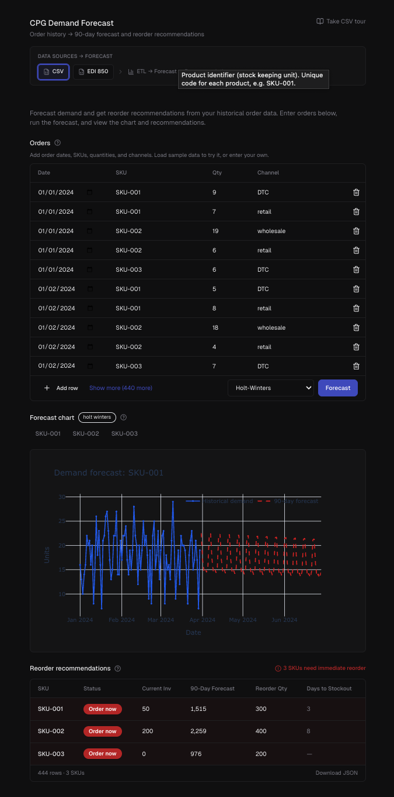

# CPG Demand Forecast

Order history → 90-day demand forecast and reorder recommendations. CSV or EDI 850 input. No spreadsheets.

**[Live demo](https://cpg.coolify.momen.earth)** · **[Watch walkthrough](https://www.loom.com/share/722ec4d68e65410384b5d1acef7de75e)** — CSV and EDI flows, guided tour, forecast chart, and recommendations.



## Features

- **90-day demand forecast** per SKU (Holt-Winters, simple mean, naive, rolling MA, exp smoothing)
- **Reorder recommendations** — Order now, Low stock, or OK
- **CSV or EDI 850** — Table input or paste X12 850 Purchase Orders
- **Interactive charts** — Historical demand + forecast per SKU
- **Guided tours** — Auto-start CSV/EDI walkthrough on first visit

## Quick start

```bash
python -m venv .venv && source .venv/bin/activate  # Windows: .venv\Scripts\activate
pip install -e .

# CLI with sample data
cpg-forecast data/sample_orders.csv --config data/sample_config.json -o output/report.html
```

## Web app

```bash
# Backend
uvicorn api.main:app --host 0.0.0.0 --port 8000

# Frontend (separate terminal)
cd frontend && npm install && npm run dev
```

Open http://localhost:5173. Or use Docker:

```bash
docker compose -f docker-compose.yml -f docker-compose.dev.yml up
```

## Input

**CSV** — `order_date`, `sku`, `quantity`, `channel` (optional)

**EDI 850** — X12 Purchase Order. Paste raw content or upload `.edi` / `.x12`. Parser extracts BEG (date), PO1 (qty, SKU), N1 (channel).

**Config** (optional) — Lead times, safety stock, current inventory, MOQ per SKU. See `data/sample_config.json`.

## Output

- **Chart** — Historical demand (blue) + 90-day forecast (red dashed) per SKU
- **Recommendations** — Status, reorder qty, days to stockout
- **JSON** — `forecast_90d_total`, `reorder_point`, `reorder_quantity`, `recommendation`

## API

```bash
# Sample data
curl "http://localhost:8000/api/forecast?sample=true&horizon=90"

# Upload CSV or EDI
curl -X POST -F "orders=@data/sample_orders.csv" -F "config=@data/sample_config.json" http://localhost:8000/api/forecast
curl -X POST -F "orders=@data/sample_850.edi" -F "horizon=90" http://localhost:8000/api/forecast

# JSON orders (editable table)
curl -X POST -H "Content-Type: application/json" -d '{"orders":[{"order_date":"2024-01-01","sku":"SKU-001","quantity":10,"channel":"DTC"}]}' http://localhost:8000/api/forecast/json
```

## Tech

- **ETL** — Load → clean (SKU, qty) → aggregate by (sku, date)
- **Forecast** — Holt-Winters (statsmodels) with fallback to simple mean for sparse data
- **Inventory** — Reorder point = lead time demand + safety stock; 95% service level
- **Sources** — `CsvSourceAdapter`, `EdiSourceAdapter`; see [docs/EDI_INTEGRATION.md](docs/EDI_INTEGRATION.md)

## Chat (optional)

AI agent for natural-language forecasts. Requires `CLOUDFLARE_ACCOUNT_ID` and `CLOUDFLARE_API_TOKEN`. Forecast tab works without them.

## Tests

```bash
pip install -e ".[dev]"
pytest tests/ -v
```

## Deploy

```bash
docker compose up --build
```

App at http://localhost:8000. Coolify: Docker Compose → one service, port 8000.

---

MIT
